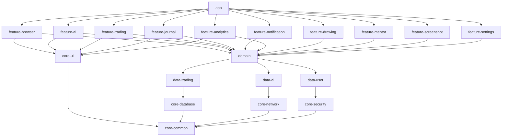
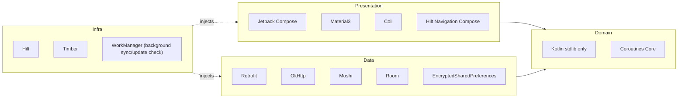
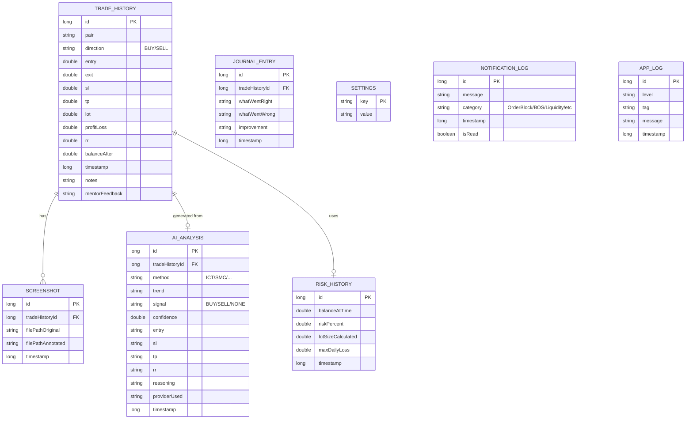
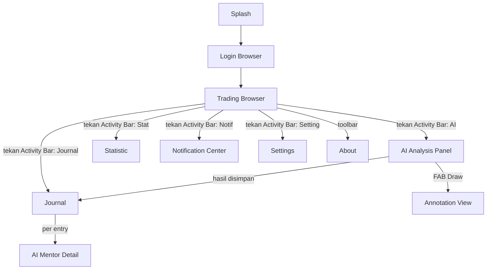
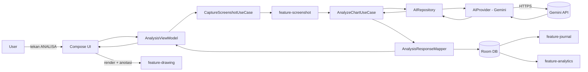
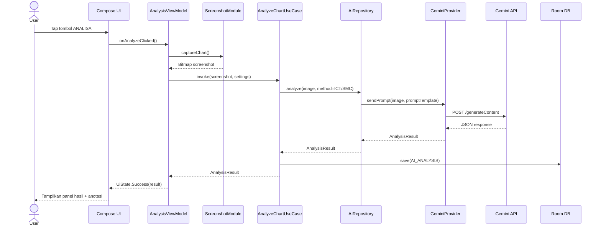
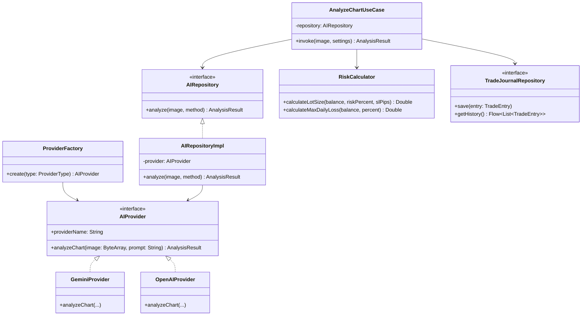

# TradePilot AI — Architecture Blueprint (Versi 0)

> **Status:** Pre-coding design document.
> **Prinsip dasar:** Aplikasi ini BUKAN broker. Aplikasi adalah *smart browser* yang membuka terminal web Exness, ditambah AI Copilot yang **hanya memberi rekomendasi**. AI tidak pernah menekan tombol BUY/SELL. Semua eksekusi tetap manual oleh user.

---

## 0. Ringkasan Teknis

| Aspek | Pilihan |
|---|---|
| Platform | Android APK, min SDK 29 (Android 10), target SDK 36 (Android 16) |
| Bahasa | Kotlin |
| UI Toolkit | Jetpack Compose (Material 3, custom theme "VS Code style") |
| Browser Engine | Android WebView (dengan JS bridge terkontrol) |
| AI | Google Gemini Free API (via abstraksi Provider, bisa diganti) |
| Database | Room |
| Secure Storage | EncryptedSharedPreferences (Jetpack Security) |
| Image | Coil (loading), Android Bitmap/Canvas (anotasi) |
| DI | Hilt |
| Arsitektur | Clean Architecture + MVVM + Modular (multi-module Gradle) |
| Networking | Retrofit + OkHttp |
| Concurrency | Kotlin Coroutine + Flow/StateFlow |
| JSON | Moshi |
| Logging | Timber |

### Kenapa UI "ala VS Code"?
Sesuai preferensi kamu, tampilan diarahkan menyerupai code editor profesional: sidebar ikon vertikal di kiri (Activity Bar), panel bisa di-*dock*/collapse, command palette (`Ctrl/⌘+Shift+P` style — di Android jadi tombol search mengambang), status bar tipis di bawah, tema gelap default dengan aksen warna khas editor (biru/ungu), font monospace untuk data numerik (harga, lot, R:R). Ini dijabarkan di bagian **6. UI/UX & Screen Design**.

---

## 1. Project Tree (Root Level — Multi Module)

```
TradePilotAI/
├── app/                                  # entry point, DI graph root, navigation host
├── build-logic/                          # convention plugins (Gradle)
├── core/
│   ├── core-ui/                          # design system: theme "VS Code", komponen umum
│   ├── core-common/                      # utils, Result wrapper, dispatcher provider
│   ├── core-database/                    # Room: DB instance, migrations
│   ├── core-network/                     # Retrofit/OkHttp setup, interceptors
│   ├── core-security/                    # EncryptedPrefs, cert pinning, root detection
│   ├── core-logging/                     # Timber tree config
│   └── core-testing/                     # fake/mocks, test rules
├── feature/
│   ├── feature-browser/                  # WebView Exness
│   ├── feature-ai/                       # AI Engine + Provider interface
│   ├── feature-trading/                  # Money Management, Risk Calculator
│   ├── feature-journal/                  # Trading Journal otomatis
│   ├── feature-notification/             # AI Copilot notifikasi realtime
│   ├── feature-analytics/                # Statistik, histori, rekomendasi berbasis histori
│   ├── feature-drawing/                  # Draw/Annotation engine di atas screenshot
│   ├── feature-mentor/                   # AI Mentor (evaluasi post-trade)
│   ├── feature-screenshot/               # Capture, crop, compress
│   └── feature-settings/                 # Settings Manager
├── data/
│   ├── data-trading/                     # Repository impl: Money Mgmt, Journal
│   ├── data-ai/                          # Repository impl: AI provider orchestration
│   └── data-user/                        # Repository impl: user/session/settings
├── domain/                               # UseCases + model murni Kotlin (no Android deps)
└── docs/                                 # dokumen arsitektur, diagram, ADR
```

**Aturan modul:** setiap `feature-*` hanya boleh bergantung pada `domain` dan `core-*`. Tidak boleh bergantung langsung ke `feature-*` lain — komunikasi antar-fitur lewat **event bus internal** (`SharedFlow` di `core-common`) atau lewat `domain` UseCase bersama. Ini menjaga independensi modul sesuai requirement.

---

## 2. Module Diagram



**Prinsip:** panah hanya boleh mengarah ke bawah (feature → domain → data → core). Tidak ada panah balik. Ini mencegah *circular dependency* dan menjaga tiap modul bisa dikompilasi/ditest terpisah.

---

## 3. Dependency Diagram (Library per Layer)



Domain layer **wajib** bebas dari dependency Android/library eksternal (kecuali Kotlin Coroutines core) supaya bisa diuji murni sebagai unit test tanpa emulator.

---

## 4. Folder Structure (Detail per Module — contoh `feature-ai`)

```
feature-ai/
├── src/main/java/com/tradepilot/ai/
│   ├── presentation/
│   │   ├── AnalysisScreen.kt
│   │   ├── AnalysisViewModel.kt
│   │   ├── AnalysisUiState.kt
│   │   └── AnalysisUiEvent.kt
│   ├── engine/
│   │   ├── AIProvider.kt              # interface
│   │   ├── GeminiProvider.kt          # implementasi default
│   │   ├── OpenAIProvider.kt          # opsional, disabled by default
│   │   ├── ProviderFactory.kt
│   │   └── PromptBuilder.kt           # menyusun prompt ICT/SMC terstruktur
│   ├── di/
│   │   └── AIModule.kt
│   └── mapper/
│       └── AnalysisResponseMapper.kt
└── src/test/java/com/tradepilot/ai/
    └── ...unit tests
```

Setiap `feature-*` mengikuti pola yang sama: `presentation / (engine|logic) / di / mapper`, ditambah `domain` module berisi:

```
domain/
├── model/          # AnalysisResult, TradeEntry, RiskProfile, AccountInfo, dll (pure Kotlin data class)
├── usecase/        # AnalyzeChartUseCase, CalculateRiskUseCase, SaveJournalUseCase, dll
└── repository/     # interface saja (implementasi ada di modul data-*)
```

---

## 5. Database Schema (Room)



Semua data trading tersimpan **lokal** (Room + file system terenkripsi untuk screenshot), sesuai requirement "semua data diproses lokal semaksimal mungkin".

---

## 6. UI/UX & Screen Design ("VS Code Style")

### 6.1 Layout Utama (mengikuti metafora code editor)

```
┌───────────────────────────────────────────────┐
│  Status Bar (harga live, koneksi, AI status)   │ ← tipis, mirip status bar VS Code
├────┬──────────────────────────────────────────┤
│ A  │                                            │
│ c  │                                            │
│ t  │           WebView (Chart Exness)           │
│ i  │                                            │
│ v  │                                            │
│ i  │                                            │
│ t  ├────────────────────────────────────────────┤
│ y  │   Bottom Panel (collapsible):               │
│    │   [Hasil Analisa] [Journal] [Log AI]        │
│ B  │   ← mirip "Terminal/Problems panel" VS Code │
│ a  │                                              │
│ r  │                                              │
└────┴──────────────────────────────────────────┘
```

- **Activity Bar** (kiri, ikon vertikal): Browser, AI Analysis, Journal, Statistic, Notification, Settings.
- **Bottom Panel** collapsible seperti Terminal VS Code: menampilkan hasil analisa AI, log real-time Copilot, riwayat singkat.
- **Command Button mengambang**: tombol `ANALISA` besar (floating action button) — setara "Run" di VS Code, mudah dijangkau ibu jari.
- **Font**: data numerik (harga, lot, RR) pakai monospace (mis. JetBrains Mono) agar presisi terbaca jelas, teks umum pakai sans-serif standar Material.
- **Tema**: Dark Mode default (`#1E1E1E` background khas editor), aksen warna signal: hijau (BUY/profit), merah (SELL/loss), kuning (warning/liquidity), biru (order block/info) — konsisten dengan permintaan anotasi warna di versi 5.

### 6.2 Daftar Screen

| Screen | Fungsi |
|---|---|
| Splash | Cek session, load settings |
| Login Browser | WebView `my.exness.com/webtrading`, user login sendiri |
| Trading Browser (Main) | WebView + Activity Bar + FAB Analisa |
| AI Analysis Panel | Hasil analisa (trend, signal, entry/SL/TP, confidence, alasan) |
| Money Management | Kalkulator risk %, lot, position size, daily loss limit |
| Journal | Riwayat trade otomatis + evaluasi AI |
| Statistic | Winrate, profit factor, average RR, equity curve |
| AI Mentor | Penjelasan post-trade (kenapa entry bagus/buruk) |
| Notification Center | Log notifikasi Copilot (Order Block, BOS, Liquidity) |
| Settings | Risk %, provider AI, API key, theme, bahasa, timeframe |
| About | Versi, disclaimer legal |

---

## 7. Navigation Diagram



Navigasi menggunakan **single Activity + Compose Navigation**, bottom panel dan side activity bar bersifat *persistent* (tidak reset saat pindah tab), mirip perilaku panel di VS Code yang tetap terbuka.

---

## 8. Data Flow Diagram (Level 1)



Alur ini menegaskan: **tidak ada satupun jalur dari AI/VM menuju kontrol WebView untuk klik BUY/SELL** — WebView hanya menerima input navigasi (refresh/back/forward), bukan input trading otomatis.

---

## 9. Sequence Diagram — Alur "Tekan ANALISA"



---

## 10. Class Diagram (Inti — AI Provider Abstraction & Repository)



Pola `Interface + Factory` inilah yang memenuhi requirement: **provider AI (Gemini/OpenAI/Claude/DeepSeek/Qwen) bisa diganti tanpa mengubah aplikasi utama** — cukup implementasi baru dari `AIProvider` dan daftarkan di `ProviderFactory`.

---

## 11. State Management

- **Pattern:** Unidirectional Data Flow — `UiState` immutable + `UiEvent` sealed class per screen.
- **ViewModel** expose `StateFlow<UiState>`; Compose `collectAsStateWithLifecycle()`.
- **Global App State** (session, settings, active AI provider) disimpan di `AppStateHolder` (singleton via Hilt) dan didistribusikan lewat `SharedFlow`/`StateFlow`, dibaca modul manapun tanpa saling bergantung langsung.
- **Event lintas modul** (misal: AI Copilot mendeteksi Order Block → harus muncul di Notification Center) memakai `EventBus` ringan berbasis `SharedFlow<AppEvent>` di `core-common`, bukan dependency langsung antar `feature-*`.

## 12. Error Handling

- Semua operasi I/O dibungkus `Result<T>`/`sealed class Outcome` (Success, Error, Loading) — tidak ada exception mentah naik ke UI.
- Kategori error: `NetworkError`, `AIProviderError` (mis. quota Gemini habis → auto fallback ke provider lain jika dikonfigurasi), `DatabaseError`, `SecurityError` (root/dev-mode terdeteksi).
- Global `CoroutineExceptionHandler` + Timber untuk logging, tidak pernah crash silent.
- WebView error (gagal load Exness) → tampilkan retry state, bukan blank screen.

## 13. Security Design

- API Key Gemini **tidak pernah** di source code — disimpan di `EncryptedSharedPreferences`, diinput user sendiri lewat Settings (atau di-inject via `local.properties` untuk dev build, di-strip saat release).
- Certificate Pinning untuk domain Gemini API & Exness.
- Root detection & Developer Mode detection → tampilkan warning, opsional block fitur AI.
- Screenshot Protection: `FLAG_SECURE` opsional di screen yang menampilkan data akun (Money Management).
- Obfuscation via R8/Proguard untuk release build.
- WebView di-*hardened*: disable `setAllowFileAccess`, `setAllowUniversalAccessFromFileURLs`, JS interface dibatasi hanya untuk fungsi capture, tidak ada `addJavascriptInterface` yang expose kontrol trading.

---

## 14. Roadmap Development

| Fase | Fokus | Output |
|---|---|---|
| **Fase 0** | Setup project, module skeleton, CI dasar | Multi-module Gradle jalan, app kosong bisa build |
| **Fase 1** | `feature-browser` — WebView Exness + toolbar | User bisa login & trading manual di dalam app |
| **Fase 2** | `feature-screenshot` + `feature-ai` (Gemini) | Tombol ANALISA menghasilkan analisa teks (versi 1) |
| **Fase 3** | `feature-drawing` — anotasi hasil analisa | Screenshot beranotasi (versi 5) |
| **Fase 4** | `feature-trading` — Money Management | Kalkulator risk/lot/RR (versi 2) |
| **Fase 5** | `feature-journal` — Trading Journal otomatis | Auto-save & evaluasi trade (versi 3) |
| **Fase 6** | `feature-notification` — AI Copilot realtime | Notifikasi Order Block/BOS/Liquidity (versi 4) |
| **Fase 7** | `feature-analytics` — histori & rekomendasi | Insight setelah 100 trade (versi 6) |
| **Fase 8** | `feature-mentor` — AI Mentor | Evaluasi edukatif post-trade (versi 7) |
| **Fase 9** | Hardening: security, performance, testing | Release candidate |
| **Fase 10** | Rilis internal (closed testing) → publik | APK stabil |

## 15. Testing Strategy

- **Unit Test** (JUnit5 + MockK): domain UseCase, RiskCalculator, Mapper — target coverage domain layer >80%.
- **Repository Test:** in-memory Room DB (Robolectric) untuk verifikasi query.
- **UI Test:** Compose Test Rule untuk screen kritikal (Analysis, Money Management).
- **Contract Test AIProvider:** mock response Gemini API (MockWebServer) memastikan mapping JSON→domain model konsisten walau provider diganti.
- **Security Test:** verifikasi tidak ada API key ter-hardcode (lint rule custom), verifikasi cert pinning aktif di build release.
- **Manual QA checklist:** login flow, tombol ANALISA end-to-end, jurnal tersimpan lokal setelah app di-kill.

## 16. Deployment Strategy

- **Build variant:** `debug`, `staging`, `release` (release: minify+shrink+proguard, staging: untuk internal testing dengan log verbose).
- **Distribution awal:** APK signed, dibagikan lewat closed testing (Firebase App Distribution atau Play Internal Testing) — belum publik karena menyangkut data akun trading.
- **Update Manager module:** cek versi lewat endpoint ringan, tampilkan prompt update in-app tanpa mengubah arsitektur inti (siap tapi belum wajib dipakai di fase awal).
- **Crash/Analytics:** Timber tree terpisah untuk release (kirim ke backend log ringan atau tetap lokal sesuai kebijakan privasi — perlu diputuskan sebelum publish).

## 17. Future Expansion (Arsitektur Sudah Disiapkan, Belum Diaktifkan)

- **Drawing Engine lanjutan:** layer, zoom, rotate, undo/redo (struktur class sudah dirancang di `feature-drawing`, implementasi UI menyusul).
- **Multi-provider AI simultan:** bandingkan hasil Gemini vs provider lain untuk 1 chart (arsitektur `ProviderFactory` sudah mendukung multi-instance).
- **Multi-broker support:** `feature-browser` dirancang agar URL terminal web tidak *hardcoded* di banyak tempat — cukup tambah `BrokerConfig` baru.
- **Cloud sync opsional:** saat ini semua lokal; jika nanti user minta backup cloud, tinggal tambah `data-sync` module baru tanpa mengubah domain layer.
- **Voice/TTS notification** untuk Copilot alert saat user tidak melihat layar.
- **Web/Desktop companion** (di luar scope APK) — dimungkinkan karena `domain` layer pure Kotlin, bisa di-share ke Kotlin Multiplatform di masa depan.

---

## 18. Keputusan Terkunci (Decision Log)

| # | Keputusan | Status |
|---|---|---|
| 1 | Gemini API key sudah dimiliki user | Disimpan via Settings → `EncryptedSharedPreferences`, tidak pernah di source code |
| 2 | `FLAG_SECURE` | Hanya aktif di screen **Money Management** |
| 3 | Notifikasi AI Copilot (versi 4) | Hanya aktif **selama app dibuka** (bukan background service permanen) — hemat kuota API & baterai. Bisa diupgrade ke background service di fase Future Expansion tanpa mengubah arsitektur (cukup ganti trigger di `feature-notification`) |
| 4 | Bahasa aplikasi | **Dwibahasa ID/EN** sejak awal, default ID, fallback EN via `res/values` dan `res/values-en` |

Blueprint dianggap **disetujui**. Lanjut ke implementasi Fase 0.
